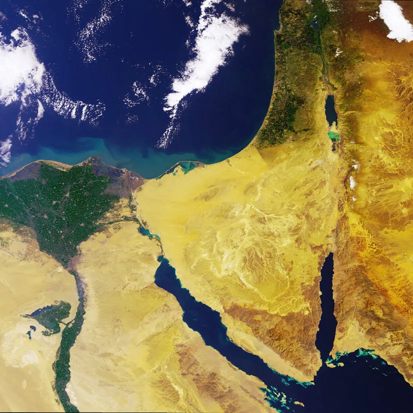
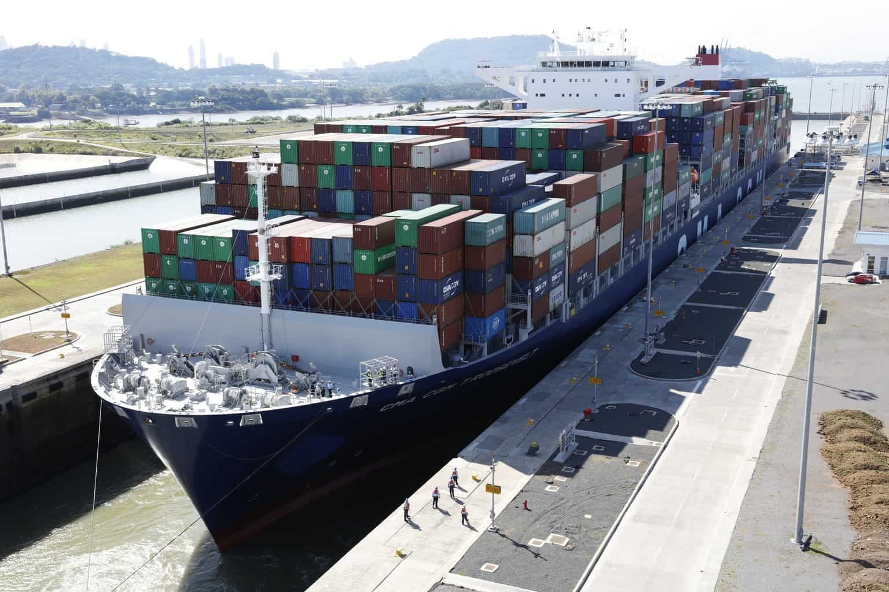

# Transportation as a Constraint

**by johnswentworth**
*5th Apr 2020*

---

Imagine it's late autumn of 332 BC. You're Alexander the Great, and your armies are marching toward Egypt from Gaza. There's just one little problem: you need to cross the Sinai peninsula - 150 miles of hot, barren desert. How will you carry food and water for the troops?

*Green triangle on the left is the Nile river delta in Egypt; green chunk in the upper right is Israel. The big desert peninsula between them is the Sinai.*

**Option 1: carry it**

A physically-active human needs about 3 lbs of food per day. (Modern hikers can probably find lighter calorie-dense foodstuffs, but we're talking ancient history here.) Water requirements vary; 5 lbs is a minimum, but the US Army Quartermaster Corps recommends 20 lbs/day when marching through a hot desert. Alexander's army crossed the desert in 7 days. Food might be reasonable, but to carry the water would mean 7*20 = 140 lbs per person, *plus* 50+ lbs of armor, weapons, etc.

When I go hiking, I aim for a 20-30 lb pack. US marines are [apparently expected](https://www.popularmechanics.com/military/research/a25644619/soldier-weight/) to be able to carry 150 lbs for 9 miles - quite a bit less than the 20+ miles/day Alexander's army managed, and with no comment on how long the marine in question might need to rest afterwards. (Also, I'm not sure I trust that source - 150 lbs for 9 miles sounds unrealistic to me, and if it's true then I'm *very* impressed by marines.)

Suffice to say that carrying that much water across that much desert is not a realistic option, even if we drink it along the way.

**Option 2: horses**

A horse consumes 20 lbs of food (half of which may be forage) and 80 lbs of water per day. In exchange, it can carry about 200 lbs (surprisingly, my source claims that horses can carry more than they can pull). Of course, that 200 lbs has to include the horse's own food and water, plus whatever useful load it's carrying. So, marching through a desert, a horse can only transport (200 lbs)/(80+20 lbs/day) = 2 days of supplies *for itself*, and that's before whatever useful things actually need to be transported.

In other words, there's a hard upper limit on how far goods can be transported by horse without refilling supplies along the way. That limit is around 2 days travel time without any refill, 10 days if there's plenty of fresh water along the route, or 20 days if there's both water and forage. At 20 miles/day, that's 40, 200, or 400 miles. Realistically, if we want the number of horses to be reasonable, the limit is more like half that much - 20 miles, 100 miles, or 200 miles, respectively.

So horses also won't work.

**Option 2.5: camels or other pack animals**

Contrary to popular image, camels actually need more water than horses. They can go a couple days without, but then need to fill up all at once. They can also carry a bit more weight, but they eat more food. At the end of the day, the numbers end up quite similar.

Mules also end up with similar numbers, and cattle are generally worse.

**Option 3: ships**

Assuming the army marches along the coast, a supply fleet can sail alongside. At the time, a single large merchant ship could carry 400 tons - in other words, as much as about 4000 horses. Presumably the ship would cost a lot less than the horses, too.

Well then, there's our answer. Ships are clearly a vastly superior way to move goods. Range is a non-issue, capacity is far larger, and they're far cheaper. They're perfect for crossing the Sinai, which runs right along the coast anyway.

Fast forward a few years to 327 BC, and Alexander is marching his armies back from India. He plans to cross the Gedrosian desert, along the coast of modern-day Pakistan and Iran. The plan is much like the Sinai: a supply fleet will sail alongside the army. Unfortunately, neither Alexander nor his commanders knows about the monsoons: across most of south Asia, the wind blows consistently southwest for half the year, and consistently northeast for the other half. There is nothing like it in the Mediterranean. And so, Alexander marches out expecting the fleet to catch up as soon as the winds turn - not realizing that the winds will not turn for months. Three quarters of his soldiers die in the desert.

Thus end the campaigns of Alexander.

## Generalization

The above numbers are drawn from Donald Engels' book [Alexander the Great and the Logistics of Macedonian Army](https://smile.amazon.com/Alexander-Great-Logistics-Macedonian-Army/dp/0520042727/). But it tells us a lot more about the world than just the logistics of one particular ancient army.

First, this highlights the importance of naval dominance in premodern warfare. A fleet was a far superior supply train, capable of moving a high volume of food and water over long distance at relatively low cost. Without a fleet, transport of food became expensive at best, regular resupply became a strategic necessity, and long routes through arid terrain became altogether impassable. Destroying an enemy's fleet meant starving the army. Likewise, controlling ports wasn't just for show - without a port, feeding the army became a serious problem.

Another interesting insight into premodern warfare: away from friendly seas and rivers, the only way to keep an army fed was to either seize grain from enemies, or buy it from allies, either of whom needed to already be nearby. In Alexander's case, deals were often struck to establish supply caches along the army's intended route.

An interesting exercise: to what extent was transportation a binding constraint on the size of premodern towns/cities? (One number you may want: [Braudel](https://www.amazon.com/Civilization-Capitalism-15th-18th-Century-Vol/dp/0520081145) (pg 121) estimates that 5000 square meters of land growing wheat would provide one person-year of food, not accounting for crop rotation.) Leave a comment if you try a calculation here; I'm curious to see how other peoples' models compare to my own.

## Modern Day

Today we have trains and trucks and roads, so the transportation constraint has relaxed somewhat. But here's an interesting comparison: a modern 18-wheeler in the US is legally limited to haul 40 tons, while a panamax ship could carry about 50k tons through the canal (prior to the opening of the new locks in 2016). That's a ratio of a bit over 1000 - surprisingly similar to the ship/horse ratio of antiquity, especially considering the much larger new-panamax and super-panamax ships also in use today.

Can we get a quick-and-dirty feel for tautness of the transportation constraint today? Here are a few very different angles:

- [This USDA study](https://www.ers.usda.gov/webdocs/publications/45165/41077_err160.pdf?v=0) shows rates on produce transport, typically about 7-20 cents per pound (see figure 6). The Smart & Final grocery store near me sells the cheaper produce items looked at in that study (bell peppers, cantaloupes, tomatoes, oranges) for 70-100 cents per pound, so transport alone is roughly 10-20% of the cost-to-consumer.
- What about transporting humans? [Average commute in the US](https://www.visualcapitalist.com/average-commute-u-s-states-cities/) is ~30 minutes each way; driving is usually in the 20-30 minute range, while public transit is usually 30-50. Assuming 8 hr workdays, that means commutes are typically ~10-20% of our work-hours.
- The bureau of transportation [estimates](https://www.bts.gov/transportation-economic-trends/tet-2018-chapter-2-contribution-economy) transport at 5.6% of the US economy for a very narrow measure, or 8.9% with a broader measure (though this still excludes non-market transport costs like e.g. commute time).

My interpretation: the transportation constraint becomes taut when it accounts for 10-20% of cost. If it's less than that, it usually doesn't limit production - we see plenty of goods which aren't transportation-dependent or which are higher-value-per-weight, and the transportation constraint is generally slack for those. But once transportation hits about 10-20%, people start looking for alternatives, i.e. producing the goods somewhere else or using alternative goods. Obviously this is not based on very much data, but I find it intuitively plausible.

Compared to ancient times, transportation constraints have obviously relaxed quite a lot. Yet qualitatively, the world today still does not look like a world of fully slack transportation constraints. To wrap up, let's discuss what that would look like.

## Extreme Slackness

In [Material Goods as an Abundant Resource](https://www.lesswrong.com/s/xEFeCwk3pdYdeG2rL/p/eWxizGwgpNhckrzfc), we discussed the world of the duplicator - a device capable of copying any item placed on it. In such a world, material scarcity is removed as an economic constraint - all material constraints are completely slack.

What would be a corresponding sci-fi device for transportation constraints, and what would that world look like?

I suggest portals: imagine we can create pairs of devices capable of transporting things from one device to the other, across any distance, at the speed of light. (We could instead imagine teleporters, removing the need for a pre-installed device at either end, but then the entire discussion would be about security.) What does the world of the portal look like?

First, there's complete geographical decoupling of production from consumption. People have no need to live near where they work; companies can put offices and factories wherever real estate is cheap. We can enjoy miles of wilderness on the back porch and a downtown district on the front porch; a swimming pool can open right into the ocean. Buying direct from the farm or factory is standard for most material goods.

What are now tourist destinations would become options for an evening activity. Disneyworld would sell a park-hopper ticket that includes Disneyland California, Paris, and Shanghai, but the price of that ticket would be high enough to prevent the parks from becoming unpleasantly crowded - probably quite a bit more expensive than today, though possibly cheaper than today's flights to Orlando.

Obviously roads would cease to exist. Huge amounts of land would revert from asphalt to wilderness, but buildings would also be much more spread out. Buildings would be built close together more for show than for function - e.g. to provide the ambiance of a downtown or a community to those who want it. Physical life, in general, would look more like the structure of the internet rather than the structure of geography; "cities" would be clusters very spread out in space but very tightly connected via the portal network. Filter bubbles would be a much more physically tangible phenomenon.

Geographically-defined governments would likely be replaced by some other form of government - governments based around access to portal hubs/networks are one natural possibility. Security would be a priority, early on - carrying an unauthorized portal into an area would earn a facefull of high explosives. On the other hand, it would be hard to prevent a high degree of mobility between areas controlled by different governments; the implications for government behavior are conceptually similar to [seasteading](http://www.gramlich.net/projects/oceania/seastead2/).

The structure of space near portal networks would be different in a big-O sense; the amount of space at a distance of about r would increase exponentially, rather than like r². A nuclear warhead could go off five hundred feet away and you'd feel a breeze through a fast-branching portal network. On the other hand, viruses could spread much more rapidly.

Anyway, at this point we're getting into specifics of portals, so I'll cut off the speculation. The point is: if transportation continues to get cheaper and more efficient over time, then we will converge to the world of the portal, or at least something like it. The details do matter - portals are different from teleportation or whatever might actually happen - but any method of fully relaxing transportation constraints will have qualitatively similar results, to a large extent.
